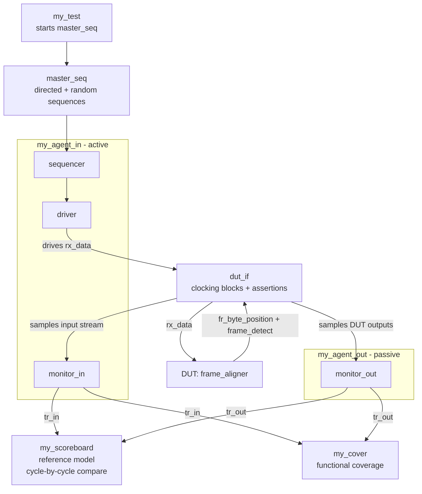
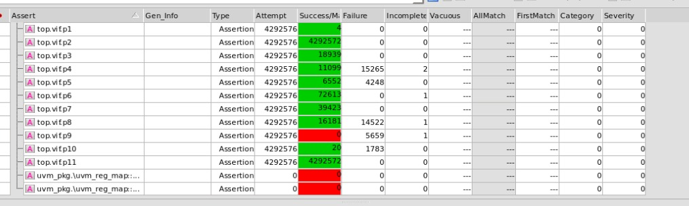
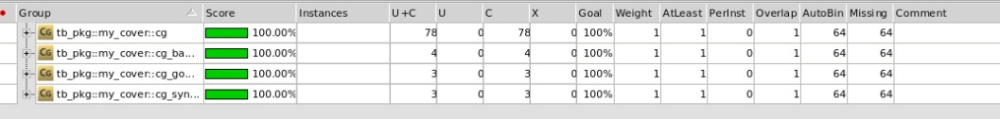
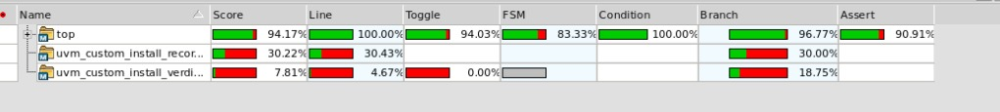
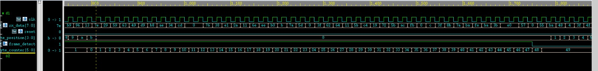
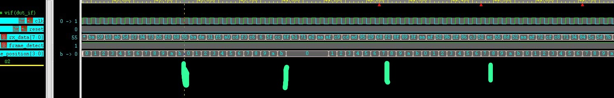
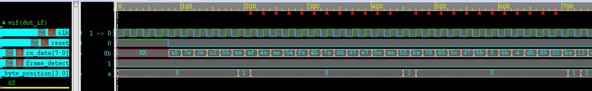

# UVM Frame Aligner Verification

SystemVerilog/UVM verification environment for a Frame Aligner DUT. The project combines directed corner-case sequences, constrained-random stimulus, a cycle-accurate reference model, a scoreboard, assertions, functional coverage, code coverage, and bug analysis.

## Project Overview

The DUT receives a continuous byte stream on `rx_data` and detects fixed-length frames based on two legal 16-bit headers:

| Header | Byte order on `rx_data` |
|---|---|
| `16'hAFAA` | `AA` followed by `AF` |
| `16'hBA55` | `55` followed by `BA` |

A complete frame contains 12 bytes:

- 2 Header bytes
- 10 Payload bytes

The design acquires synchronization after three consecutive legal frames. While synchronized, frame boundaries are fixed to 12 bytes and Header-like data inside the Payload must not shift the frame boundary. The environment also verifies synchronization loss, overlap cases, bad-MSB cases, and recovery.

## Verification Goals

- Detect both legal Headers and reject illegal combinations.
- Verify frame-position tracking on `fr_byte_position[3:0]`.
- Verify synchronization acquisition on `frame_detect`.
- Verify synchronization loss after the required invalid-frame sequence.
- Verify that Header-like byte patterns inside Payload do not corrupt synchronized frame boundaries.
- Exercise overlap cases before synchronization and around synchronization loss.
- Check DUT outputs cycle by cycle against an independent reference model.
- Collect assertions, functional coverage, and code coverage.

## UVM Testbench Architecture



`driver` injects stimulus through `dut_if`. The interface connects the testbench to the DUT and exposes the sampled signals to the monitors. `monitor_in` samples the input byte stream, while `monitor_out` samples the DUT outputs. Both monitors publish their transactions independently and in parallel to both the scoreboard and the functional coverage component.

## Main Verification Components

| Component | Role |
|---|---|
| `my_agent_in` | Active input agent containing the sequencer, driver, and `monitor_in` |
| `my_agent_out` | Passive output agent containing `monitor_out` |
| `my_scoreboard` | Reference model and cycle-by-cycle comparison of expected vs. actual outputs |
| `my_cover` | Functional coverage collection from both monitor streams |
| `dut_if` | DUT interface, clocking blocks, and assertions |
| `master_seq` | Mixes directed scenarios with random stress traffic |
| `my_test` | Builds the environment and starts the master sequence |

## Stimulus Strategy

The regression mixes targeted scenarios with constrained-random traffic. Directed tests cover, among others:

- valid Header type A and type B
- bad MSB after a legal LSB
- synchronization acquisition and interruption
- Headers appearing inside Payload
- overlap before synchronization
- overlap while synchronized
- synchronization loss and reacquisition
- overlap exactly around synchronization loss
- long random stress runs

All sequence source files are located under [`tb/sequences/`](tb/sequences/).

## Scoreboard and Reference Model

The scoreboard receives input and output transactions through separate monitor paths. For each sampled cycle it:

1. obtains the input transaction,
2. obtains the output transaction,
3. compares the observed DUT outputs against the current expected state,
4. advances the independent reference model using the sampled input byte.

The reference model is intentionally implemented independently from the DUT FSM to reduce the risk of duplicating the same design bug inside the checker.

## Assertions

Assertions are implemented in the DUT interface and check local and temporal behavior including:

- reset behavior
- legal range of `fr_byte_position`
- synchronization acquisition
- synchronization loss
- byte-position progression
- bad-LSB and bad-MSB behavior
- overlap handling
- absence of unknown `X/Z` values after reset



## Functional Coverage

Functional coverage includes Header transitions, byte values, synchronization state, byte position, crosses between data and synchronization, complete synchronized frame-position sequences, good-frame and bad-frame streaks, overlap patterns, Header-in-Payload scenarios, loss, and reacquisition.

Final functional coverage reached **100% of the defined bins**.



## Code Coverage

Coverage was collected with Synopsys VCS and reported with URG/Verdi.

| Metric | Original DUT |
|---|---:|
| Line | 100.00% |
| Condition | 100.00% |
| Toggle | 94.03% |
| Branch | 96.77% |
| FSM | 83.33% |
| Assertion coverage | 90.91% |
| Overall score | 94.17% |



The remaining coverage holes are documented in the final report and are mainly related to reset re-assertion, a defensive `default` branch, and an FSM transition outside the selected project scope.

## Bugs Found in the Original DUT

The environment intentionally checks the specified behavior rather than adapting itself to the original DUT implementation. It exposed multiple repeatable design issues:

| ID | Finding |
|---|---|
| `BUG-01` | Synchronization is lost one sample earlier than the reference timing. |
| `BUG-02` | While synchronized, the DUT can resume Header search inside the remainder of a bad frame instead of waiting for the next 12-byte boundary. |
| `BUG-03` | A legal LSB followed by a bad MSB can cause an incorrect byte-position progression. |
| `BUG-04` | Overlapping Header candidates before synchronization are not always handled correctly. |
| `BUG-05` | A corner case around the final bad frame and synchronization loss can disturb the next legal Header. |

Example debug results:







## Original DUT vs. Corrected Reference RTL

- [`rtl/Frame_aligner.v`](rtl/Frame_aligner.v) is the original DUT used for bug discovery and the project submission.
- [`rtl/Frame_aligner_good.sv`](rtl/Frame_aligner_good.sv) is a corrected reference implementation used only to validate that the verification environment itself can run cleanly.

Validation with the corrected RTL included all directed sequences and a 50,000-transaction random regression with:

- 0 scoreboard errors
- 0 assertion failures
- 0 `UVM_ERROR`
- 0 `UVM_FATAL`
- 100% functional coverage of the defined bins

This corrected RTL is not a replacement for the original DUT in the bug-analysis results.

## Repository Structure

```text
uvm-frame-aligner-verification/
├── docs/                  # Verification plan and final report
├── results/               # Coverage and waveform screenshots
├── rtl/
│   ├── Frame_aligner.v    # Original DUT
│   └── Frame_aligner_good.sv
├── tb/
│   ├── sequences/         # Directed and random sequences
│   ├── agent_in.sv
│   ├── agent_out.sv
│   ├── coverage.sv
│   ├── driver.sv
│   ├── environment.sv
│   ├── interface.sv
│   ├── master_seq.sv
│   ├── monitor_in.sv
│   ├── monitor_out.sv
│   ├── scoreboard.sv
│   ├── sequencer.sv
│   ├── tb_pkg.sv
│   ├── test.sv
│   ├── top.sv
│   └── transaction.sv
├── dut.fl
├── makefile
├── .gitignore
└── README.md
```

## Running the Project

The project is intended for Synopsys VCS with UVM support.

```bash
# Compile and open the default GUI flow
make

# Compile only
make comp

# Run simulation without GUI
make run TEST=my_test

# Run simulation with GUI
make gui TEST=my_test

# Run coverage and generate the URG report
make cov TEST=my_test

# Generate coverage and open it in Verdi
make cov_gui TEST=my_test

# Remove generated simulation files
make clean
```

The simulation uses a `1ns/1ns` timescale and a 20 ns clock period.

## Documentation

- [Verification Plan - English](docs/verification_plan_en.pdf)
- [Project documentation folder](docs/)

## Results

Additional screenshots and debug evidence are available in [`results/`](results/).

## Tools and Methodology

- SystemVerilog
- UVM
- Synopsys VCS
- URG
- Verdi
- Assertions
- Functional Coverage
- Code Coverage
- Constrained-Random Verification
- Directed Corner-Case Verification

## Author

**Yonatan Zvida**

Digital Design Verification Project, 2026
